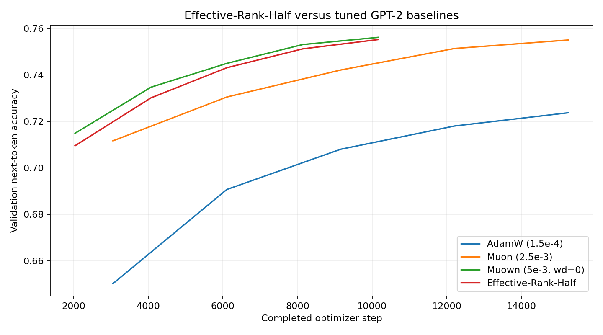
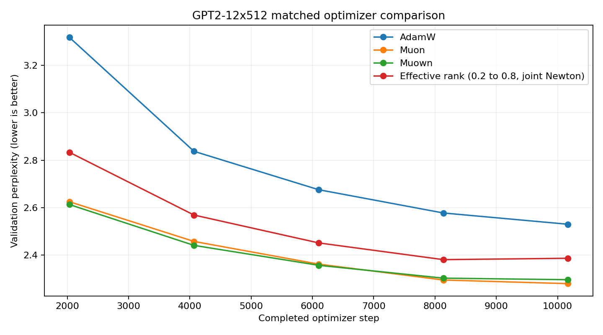
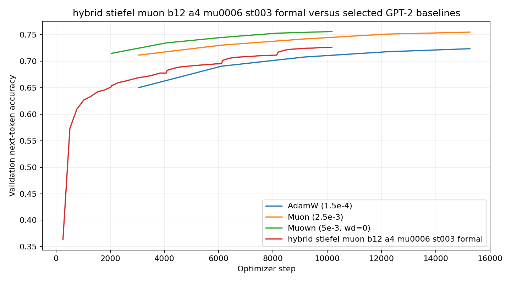
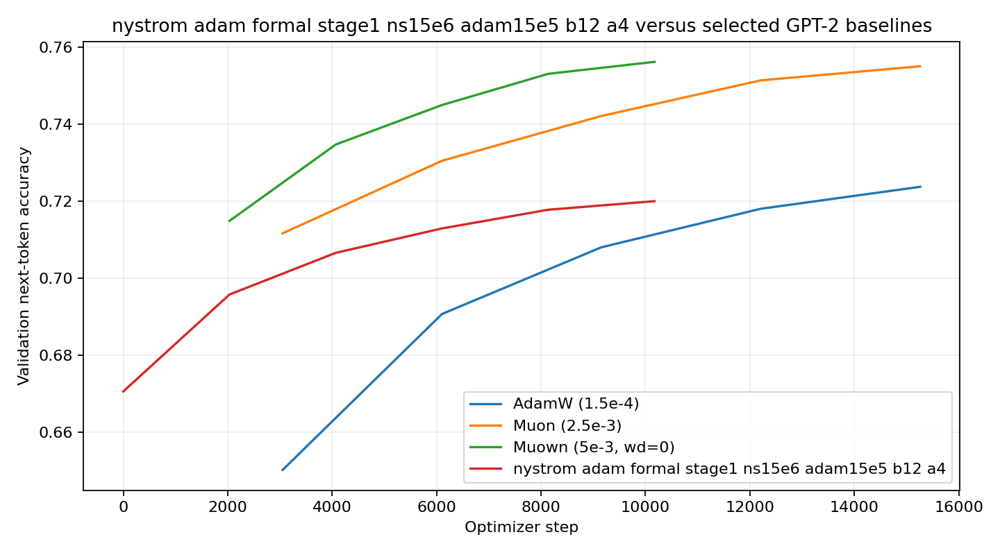

# Ideas

The repository-native implementation of the Kronecker GGN baseline and its signed low-rank relative-residual correction is documented in [KRONECKER_GGN_README.md](KRONECKER_GGN_README.md).

- [x] Adaptive Dropout Rate for each layer

- [x] Alternative Update: Adam -> GN -> Adam (With momentum saved) -> GN -> ...

- [ ] Adaptive Layer Frozen in later section of training

- [x] Low-Rank GN

# Steepest Descent with Effective Rank Constraint

- Result: Between Muon and Muown

- [] Tune lr and effective normalized rank



The completed five-epoch GPT2-12x512 perplexity comparison, including the
joint-Newton effective-rank continuation, is shown below.



# Hybrid Stiefel-Muon



# Low-Rank Gauss Newton

- Low-Rank GN is helpful in early stage of training.



# Six optimizer 2.0 GPT-2 comparison

The [six optimizer designs and equation mappings](optimizer/2.0/IMPLEMENTATION.md)
are implemented in `src/optimizer_v2/`. The independent local profile compares
all six with pinned PyTorch 2.11 AdamW/Muon on randomly initialized GPT-2 (124M),
WikiText-103, five complete epochs, seed 0, BF16, batch 8 and accumulation 4.
The [configuration](configs/experiments/gpt2_v2_5090.yaml) preserves the approved
fixed starting settings. The existing experiments remain unchanged.

```bash
bash scripts/run_gpt2_v2_5090.sh --dry-run
bash scripts/run_gpt2_v2_5090.sh --setup-only
bash scripts/run_gpt2_v2_5090.sh --output results/gpt2_v2_5090_smoke --steps 33
bash scripts/run_gpt2_v2_5090.sh --output results/gpt2_v2_5090_seed0_5epochs
```

The launcher prepares missing random-init assets, inherits the installed CUDA
Python into an isolated environment, and preserves PyTorch/Transformers versions.
See [the v2 dependency profile](requirements-gpt2-v2.txt); set `GPT2_PYTHON` if the
compatible base Python is not `/home/justin/miniconda3/bin/python`.
Reuse the same output to resume and skip verified completed methods. `Ctrl+C`
finishes the current update and saves a resumable checkpoint. Final checkpoints,
JSONL metrics/diagnostics, CSV summaries, source provenance, and step/time PNGs
remain in the output directory. This is a single-seed screen, not evidence of
optimizer superiority. Full training is left for the user to start.
